**DOKUMEN PRODUCT REQUIREMENT DESIGN: APLIKASI PRESENSI GURU**  
*Ditulis oleh: Akhmad Khanif Zyen*  
*Tanggal: 23 September 2025*  
*Versi: 1.0*

---

### **1. Pendahuluan**
Aplikasi presensi guru adalah solusi digital berbasis Flutter untuk mengelola kehadiran guru dengan dua mode presensi: **Pengajaran** (multi-sesi per hari) dan **Kehadiran Kerja** (sekali check-in/out per hari). Aplikasi ini menggunakan validasi lokasi, pengambilan foto, dan sistem toleransi waktu yang dapat dikonfigurasi admin.

---

### **2. Tujuan Produk**
- Mengotomatisasi proses presensi guru dengan validasi real-time
- Meningkatkan akurasi data kehadiran melalui deteksi lokasi dan foto
- Menyediakan dashboard administratif untuk manajemen jadwal dan laporan
- Mengurangi kecurangan presensi dengan deteksi mock location

---

### **3. Lingkup Produk**
#### **Termasuk:**
- Presensi berbasis lokasi (radius + deteksi GPS palsu)
- Dua mode presensi: Pengajaran & Kehadiran Kerja
- Sistem toleransi waktu (terlambat/pulang cepat)
- Manajemen jadwal dinamis oleh admin
- Riwayat presensi & ekspor data
- Tampilan peta dengan visualisasi radius presensi

#### **Tidak Termasuk:**
- Verifikasi foto real-time (face detection)
- Integrasi WiFi/Bluetooth untuk validasi lokasi
- Peta live guru secara real-time
- Mode offline (wajib terhubung internet)
- Notifikasi otomatis (reminder 15 menit sebelum jam masuk dan notifikasi jika guru di luar radius)

---

### **4. Fitur-Fitur Produk**

#### **4.1. Autentikasi & Manajemen Pengguna**
| Fitur | Deskripsi | Aktor |
|-------|-----------|-------|
| Login Guru | Email/password + session management | Guru |
| Login Admin | Hak akses penuh ke manajemen sistem | Admin |
| Profil Guru | Edit nama, foto profil, lihat kategori presensi | Guru |

#### **4.2. Mode Presensi**
| Fitur | Deskripsi | Keterangan |
|-------|-----------|------------|
| **Presensi Pengajaran** | Multi-sesi per hari (jam masuk/selesai) | Hitung total waktu mengajar per sesi |
| **Presensi Kehadiran Kerja** | Sekali check-in hadir + check-out pulang | Hitung total waktu kerja per hari |
| **Penentuan Kategori** | Admin tentukan guru masuk kategori mana | Satu guru hanya satu kategori |

#### **4.3. Validasi Presensi**
| Fitur | Deskripsi | Teknologi |
|-------|-----------|-----------|
| **Validasi Lokasi** | Cek radius 500m dari titik jadwal | Geolocation + deteksi mock location |
| **Visualisasi Radius** | Tampilkan peta dengan lingkaran radius | Google Maps Flutter |
| **Pengambilan Foto** | Foto saat check-in/out | Camera + Storage (Appwrite) |
| **Status Presensi** | Otomatis hitung berdasarkan toleransi | Appwrite Functions |

#### **4.4. Manajemen Jadwal (Admin)**
| Fitur | Deskripsi | Contoh |
|-------|-----------|-------|
| **Shift Dinamis** | Jadwal berbeda per hari | Senin: 07:00-15:00, Jumat: 07:30-16:00 |
| **Atur Radius** | Set lokasi + radius per jadwal | Lokasi sekolah: 500m |
| **Toleransi Waktu** | Atur batas terlambat/pulang cepat | Default: 10 menit |

#### **4.5. Exception Handling (Admin)**
| Fitur | Deskripsi | Alur |
|-------|-----------|------|
| **Izin/Cuti** | Guru ajukan izin → admin approve/reject | Otomatis skip presensi |
| **Presensi Manual** | Input presensi jika kendala teknis | Tandai sebagai "manual" |

#### **4.6. Monitoring & Laporan**
| Fitur | Deskripsi | Output |
|-------|-----------|--------|
| **Grafik Kehadiran** | Persentase hadir/terlambat/izin per bulan | Chart.js |
| **Ekspor Data** | Download laporan PDF/Excel | File terenkripsi |
| **Riwayat Detail** | Filter presensi berdasarkan tanggal/status | Tabel + statistik |

---

### **5. Persyaratan Teknis**
#### **5.1. Stack Teknologi**
| Komponen | Teknologi |
|----------|-----------|
| Frontend | Flutter (Dart 3) |
| State Management | Riverpod Generator |
| Backend | Appwrite (Serverless) |
| Database | Appwrite Collections |
| Storage | Appwrite Storage |
| Routing | go_router |
| Error Handling | Sealed Class (Dart 3) |
| Peta | Google Maps Flutter |
| Image Processing | image_picker |
| Permissions | permission_handler |
| Security | flutter_secure_storage |
| Utilities | logger |
| Server Setup | Pure Dart Appwrite SDK |

#### **5.2. Server Setup Tool**
Pure Dart CLI tool untuk setup dan manajemen Appwrite collections:

**Struktur:**
```
bin/
├── server_setup.dart              # Main CLI entry point
├── migrations/                    # Database migrations
│   ├── 001_initial_collections.dart
│   ├── 002_add_tolerances.dart
│   └── 003_add_indexes.dart
└── seeds/                         # Sample data
    ├── dev_seeds.dart
    └── prod_seeds.dart
```

**Fitur:**
- Collection creation dengan schema validation
- Migration system dengan version control
- Seed data untuk development & production
- Environment-based configuration
- Secure credential management dengan dotenv
- Rollback capabilities
- CI/CD integration

**Environment Variables (.env):**
```bash
# Appwrite Configuration
APPWRITE_ENDPOINT=https://cloud.appwrite.io/v1
APPWRITE_PROJECT_ID=your_project_id
APPWRITE_API_KEY=your_api_key
APPWRITE_DATABASE_ID=your_database_id

# Environment (dev/staging/prod)
ENVIRONMENT=dev
```

**Usage:**
```bash
dart bin/server_setup.dart init          # Setup awal
dart bin/server_setup.dart migrate up     # Run migrations
dart bin/server_setup.dart seed dev       # Seed development data
dart bin/server_setup.dart validate       # Validate schema
dart bin/server_setup.dart --env prod     # Run di production environment
```

**Security:**
- Credentials disimpan di .env file (tidak di version control)
- .env.example disediakan sebagai template
- Runtime validation untuk required environment variables
- Auto-detect environment dari file config

#### **5.3. Library Utama**
```bash
# Core Dependencies
flutter pub add riverpod_annotation
flutter pub add appwrite
flutter pub add go_router
flutter pub add freezed_annotation
flutter pub add geolocator
flutter pub add google_maps_flutter
flutter pub add intl
flutter pub add image_picker
flutter pub add permission_handler
flutter pub add flutter_secure_storage
flutter pub add logger

# Development Dependencies
flutter pub add --dev riverpod_generator
flutter pub add --dev build_runner
flutter pub add --dev freezed
flutter pub add --dev json_serializable
flutter pub add --dev mocktail
flutter pub add --dev very_good_analysis
```

**Catatan:** Menggunakan `flutter pub add` tanpa versi spesifik untuk menghindari dependency hell. Versi library akan ditentukan oleh pub.dev resolver untuk kompatibilitas optimal.

**Penjelasan Library:**
- **json_serializable:** Cukup untuk JSON serialization, digunakan bersama freezed untuk data classes
- **Sealed Class (Dart 3):** Digunakan untuk Result pattern dengan Success/Failure state di use cases
- **Riverpod:** Menangani async operations, state management, dan error handling di presentation layer

**Catatan Arsitektur:**
- **Error Handling:** Sealed Class + Riverpod AsyncValue sudah cukup untuk kebutuhan aplikasi
- **Async Operations:** Riverpod AsyncValue/Error handling lebih simple dan terintegrasi dengan Flutter ecosystem
- **State Management:** Riverpod menyediakan solusi lengkap untuk state, async, dan error handling

#### **5.4. Persyaratan Perangkat**
- **Minimum OS**: Android 8.0 (API 26) / iOS 13.0
- **Koneksi**: Wajib terhubung internet
- **Hardware**: GPS + Kamera

---

### **6. Arsitektur Sistem**
#### **6.1. Feature-First Clean Architecture**
```
lib/
├── features/
│   ├── auth/
│   │   ├── data/
│   │   │   ├── datasources/
│   │   │   ├── models/
│   │   │   └── repositories/
│   │   ├── domain/
│   │   │   ├── entities/
│   │   │   ├── repositories/
│   │   │   └── usecases/
│   │   └── presentation/
│   │       ├── pages/
│   │       ├── widgets/
│   │       ├── providers/
│   │       └── routes/
│   ├── attendance/
│   │   ├── data/
│   │   │   ├── datasources/
│   │   │   │   ├── attendance_remote_datasource.dart
│   │   │   │   └── location_datasource.dart
│   │   │   ├── models/
│   │   │   │   ├── attendance_model.dart
│   │   │   │   └── location_model.dart
│   │   │   └── repositories/
│   │   │       └── attendance_repository_impl.dart
│   │   ├── domain/
│   │   │   ├── entities/
│   │   │   │   ├── attendance_entity.dart
│   │   │   │   └── location_entity.dart
│   │   │   ├── repositories/
│   │   │   │   └── attendance_repository.dart
│   │   │   └── usecases/
│   │   │       ├── check_in_usecase.dart
│   │   │       ├── check_out_usecase.dart
│   │   │       ├── get_attendance_history_usecase.dart
│   │   │       └── validate_location_usecase.dart
│   │   └── presentation/
│   │       ├── pages/
│   │       │   ├── check_in_page.dart
│   │       │   ├── attendance_history_page.dart
│   │       │   └── attendance_map_page.dart
│   │       ├── widgets/
│   │       │   ├── attendance_status_widget.dart
│   │       │   └── location_map_widget.dart
│   │       ├── providers/
│   │       │   ├── attendance_provider.dart
│   │       │   └── location_provider.dart
│   │       └── routes/
│   ├── admin/
│   │   ├── data/
│   │   ├── domain/
│   │   └── presentation/
│   └── common/
│       ├── widgets/
│       ├── utils/
│       └── theme/
├── core/
│   ├── constants/
│   ├── error/
│   │   ├── exceptions.dart
│   │   └── failures.dart
│   ├── network/
│   │   ├── network_info.dart
│   │   └── appwrite_client.dart
│   ├── usecases/
│   │   └── usecase.dart
│   └── utils/
└── main.dart
```

#### **6.2. Clean Architecture Layers**
```
┌─────────────────────────────────────┐
│          PRESENTATION               │
│  ┌─────────────┐  ┌─────────────┐   │
│  │   Pages     │  │  Providers  │   │
│  └─────────────┘  └─────────────┘   │
│  ┌─────────────┐  ┌─────────────┐   │
│  │  Widgets    │  │   Routes    │   │
│  └─────────────┘  └─────────────┘   │
└─────────────────────────────────────┘
┌─────────────────────────────────────┐
│            DOMAIN                   │
│  ┌─────────────┐  ┌─────────────┐   │
│  │  Entities   │  │  Use Cases  │   │
│  └─────────────┘  └─────────────┘   │
│  ┌─────────────┐  ┌─────────────┐   │
│  │Repositories │  │  Failures    │   │
│  └─────────────┘  └─────────────┘   │
└─────────────────────────────────────┘
┌─────────────────────────────────────┐
│             DATA                   │
│  ┌─────────────┐  ┌─────────────┐   │
│  │ Datasources │  │  Models     │   │
│  └─────────────┘  └─────────────┘   │
│  ┌─────────────┐  ┌─────────────┐   │
│  │Repositories │  │ Exceptions  │   │
│  └─────────────┘  └─────────────┘   │
└─────────────────────────────────────┘
```

#### **6.3. Clean Architecture Principles**
- **Dependency Rule:** Dependencies hanya mengalir ke arah luar (inner → outer)
- **Feature Isolation:** Setiap fitur mandiri dengan layer sendiri
- **Domain-Driven:** Business logic di domain layer murni tanpa framework dependencies
- **Testability:** Semua komponen dapat di-test dengan dependency injection

#### **6.5. Appwrite Functions**
| Function | Trigger | Logic |
|----------|---------|-------|
| `calculateAttendanceStatus` | Saat check-in/out | Hitung status presensi berdasarkan toleransi |
| `validateLocation` | Saat check-in | Validasi radius + deteksi mock location |
| `generateReport` | Permintaan admin | Buat PDF/Excel dari data presensi |

---

### **7. Alur Pengguna**
#### **7.1. Alur Presensi Guru**
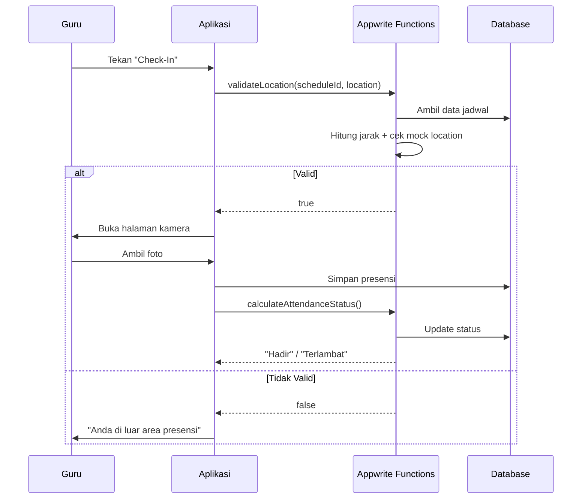

#### **7.2. Alur Admin (Atur Toleransi)**
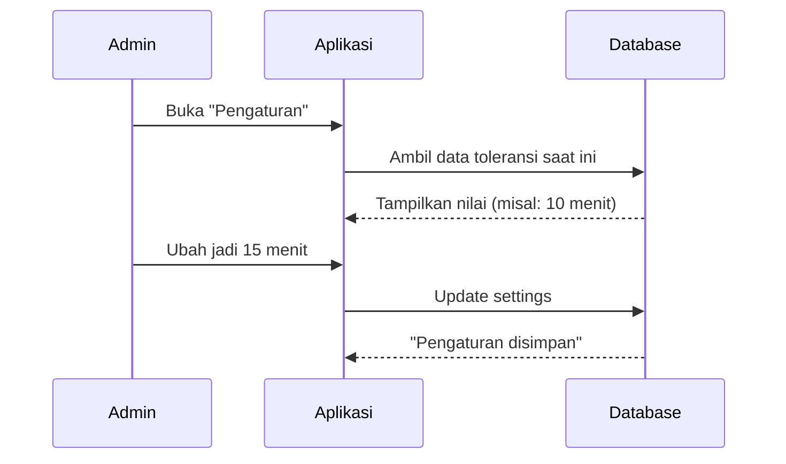

---

### **8. Persyaratan Non-Fungsional**
| Aspek | Persyaratan |
|-------|-------------|
| **Keamanan** | - Enkripsi data transit (HTTPS)<br>- Deteksi mock location<br>- Validasi input di semua layer |
| **Performa** | - Waktu respons < 3 detik untuk presensi<br>- Loading peta < 5 detik<br>- Foto dikompres sebelum upload |
| **Skalabilitas** | - Appwrite auto-scaling untuk functions<br>- Struktur database optimal untuk query |
| **Usability** | - UI minimalis dengan visualisasi radius yang jelas<br>- Dark mode support<br>- Font size adjustable |
| **Ketersediaan** | - Uptime 99.5% (SLA Appwrite) |

---

### **9. Asumsi dan Ketergantungan**
#### **Asumsi:**
- Guru memiliki smartphone dengan GPS dan kamera
- Sekolah memiliki koneksi internet stabil
- Admin terlatih untuk menggunakan dashboard
- Radius presensi telah diukur dengan akurat
- Guru akan secara proaktif membuka aplikasi untuk presensi

#### **Ketergantungan:**
- Layanan Appwrite (database, storage, functions)
- Paket data internet untuk guru
- Perangkat GPS yang akurat
- Google Maps API untuk visualisasi peta

---

### **10. Glossary**
| Istilah | Definisi |
|--------|----------|
| **Mock Location** | Pemalsuan lokasi GPS via aplikasi pihak ketiga |
| **Toleransi** | Batas waktu keterlambatan/pulang cepat yang diizinkan |
| **Sesi Pengajaran** | Satu periode mengajar (misal: Matematika jam 07:00-08:30) |
| **Shift Dinamis** | Jadwal yang berbeda per hari/hari tertentu |
| **Sealed Class** | Tipe data yang membatasi subclass (Dart 3) |
| **Visualisasi Radius** | Tampilan peta dengan lingkaran area presensi |

---

### **11. Desain UI/UX**

#### **11.1. Halaman Login**

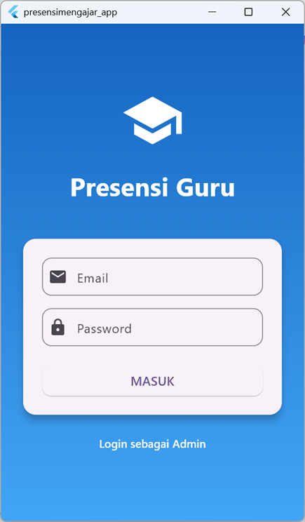

#### **11.2. Halaman Dashboard Guru**

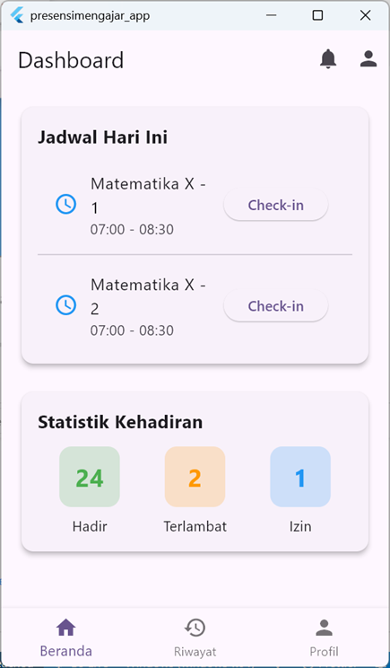

#### **11.3. Halaman Check In**

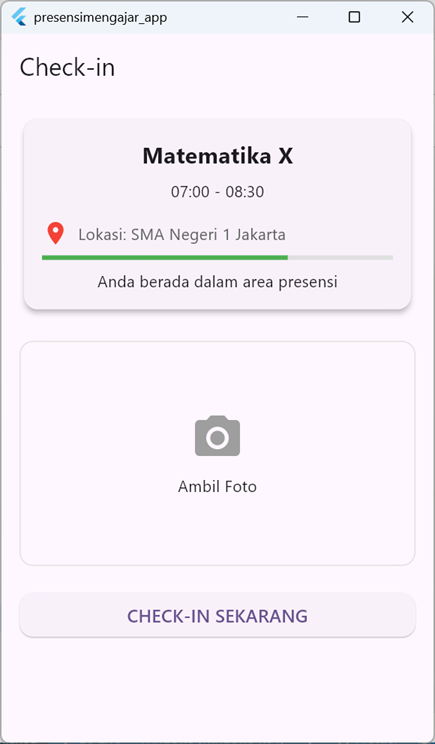

#### **11.4. Halaman Riwayat Kehadiran**

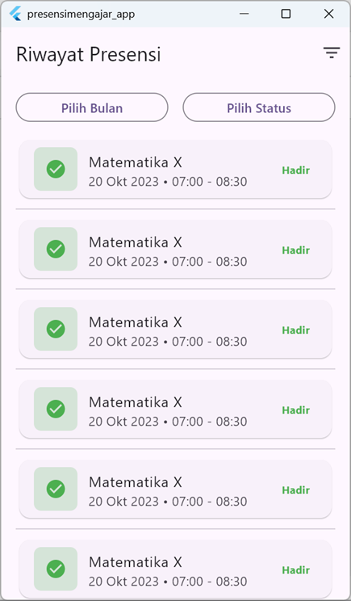

#### **11.5. Halaman Profil Guru**

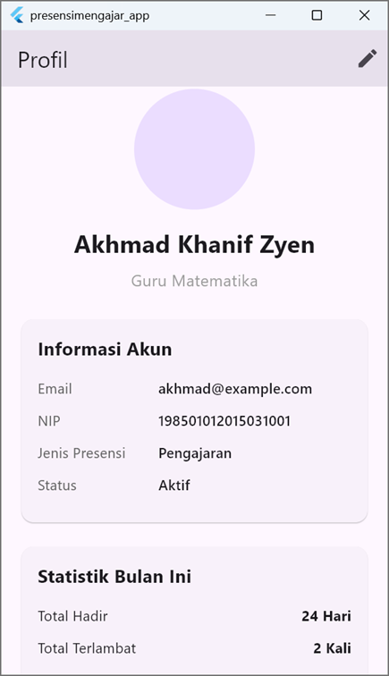

#### **11.6. Halaman Dashboard Admin**

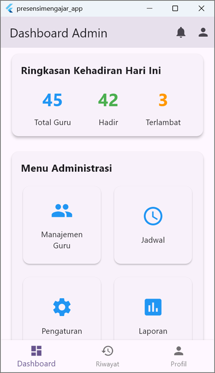

#### **11.7. Halaman Manajemen Guru**

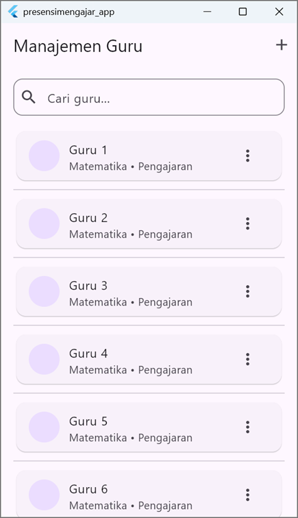

#### **11.8. Halaman Manajemen Jadwal**

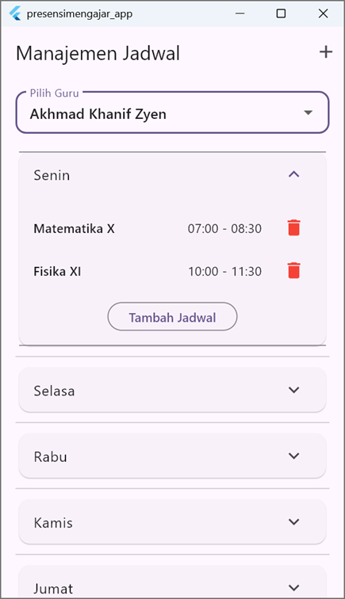

#### **11.9. Halaman Pengaturan Toleransi**

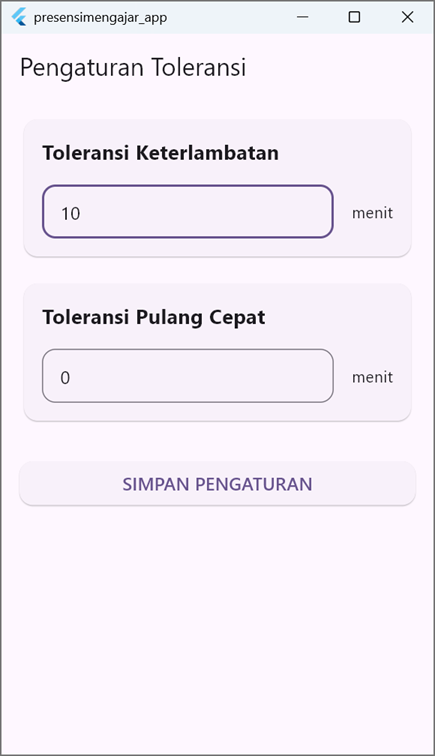

#### **11.10. Halaman Manajemen Izin/Cuti**

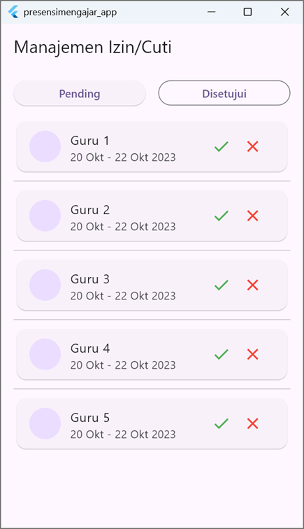

#### **11.11. Halaman Presensi Manual**

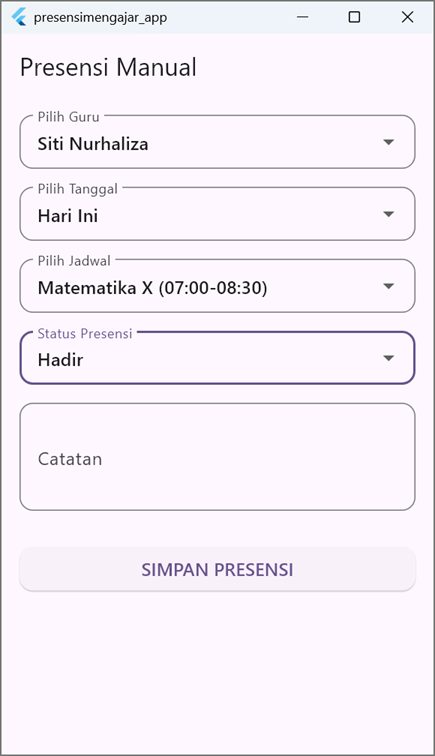

#### **11.12. Halaman Laporan**

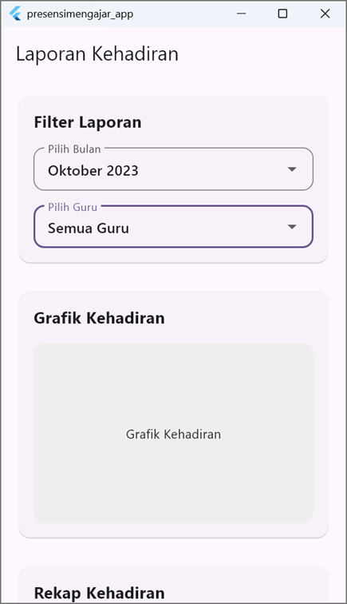

---

**Dokumen ini disetujui untuk menjadi dasar pengembangan aplikasi presensi guru.**  

